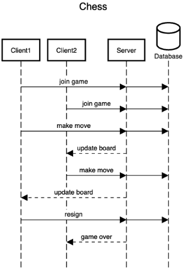

Server Diagram:

https://sequencediagram.org/index.html?presentationMode=readOnly#initialData=IYYwLg9gTgBAwgGwJYFMB2YBQAHYUxIhK4YwDKKUAbpTngUSWPAinhdYSnfoccKQCqAZ0ocqXHg36kA4sAC2KcZNy9GA5gBFgYYAEEQIFMOGYAJruAAjYKJjnrmTAHMoEAK7YYAYjTAqAE8YACUUFyRhMChdJAg0XwB3AAskMG5EVFIAWgA+ckoaKAAuGABtAAUAeTIAFQBdGAB6D1EoAB00AG9Wyn8lABoYXFNE6HMhlAVgJAQAX0xxShg8mBExQq5SqHDI9KgACl6ofpQhkeExqAmYKZmEAEpMdagVYxX8nT1DY1NSlxQYBeRzapyeXwMRhMwg+DmspTIAFEADKIuC1GDHU4wABm7gUmLamAhP2hK1WLzeKFKaA8CAQzzaVNhJKhfxgIB2uhQwKxijOwzsl3G4KspNMsMcpQAkgA5JEhDF8waC0bjSbTWYwOW1KqE2iUzbvVas37CUqctjpfQeMDJEF9fmi75smGrKXa+WIxX6k78obAW3JWoQADW6E9upggbtxLFrvJ+UNnGMpRjwbD6EZGxTKETBWolDTQZD4bQi0Ky2yq0y6DApQATAAGJudLrp0voBboczONyebw+aACAEwZEQCIJHwpNIZZB12FLErlap1RpNUSmOJoNvKgUXK7mBZLj7JiSpmAICdINAOv0qg8i7OvI15vKm6GlPcVIWHgCyuggPae7nL+T4fhK7rwr6pw-mq1wAWAQEWNYiYQeaMDRB43DoYmZ5bJhUDYc+zLvvGZqlDebRgDadqdree7OpCZqStBcoKkqbSyv60YlpmCQ3pAvGxo4aHkWSxZ0fxcYuix1a5PhF4dtJilvqsS6SRmZYVoWsDybWpCNi2u6gjxyllt2aC9q47heL4bgoBG44uJ4zDTqk6SYAZzDqZWy5lFoKKIrUiLrpuwjbp05lZkueSqf8gK0Vp6AHNFaBPKpLLieyAI0XxZapfl6APDAMnMdCeQeoFqIhcJyXlqJ8noaUZXim6cVMq+xQka++YaTpRT5t5RlNpgPZ9rZg47OYY57DA8hKDC7mzl5845PkGnlLIwXri4-JRUV5axbkC3KF1l57KdwiFVJZZPKdpGfNlGFUMAyDmPRABinhWTd9VMW1rEIkF6J1fRuL4nVKH5s1pW4fJD3nVh3CI7mZGyZ+MC5Vdf30QDCZQcDqKg1dKFNc9-z8sIyJ7K1BO+bplOLTTUQDZQ+lrfWMDNq23R7czeyWdZ-Z2T42AeFA2CsPAXLpPN-JJB5c5ZD5G1+aUlQ1A0zT8ygB23egba69xSjHn5eSo+e1IwK971fT95i4-x938o9MCw7bSAffx30eL9aX43J+QekixMYmlEMQAS6bQ+TGPssjdNyRbrtI0RKOp7mHyw5a3IwGgKCJFj-JJ2ShOehx+eF8XSgHMbTqx+j5USkzKAmzhz2JpbBH10omDd8aeQab33AnhzKsjUb-Lt0LE0Dr4gQoPSEBFwAUhAN7y0ovjWAgoChqtKuLurK6CNrTS6-r9Vtt5cAQFeUBDLr0paGbukp0oVKlAAVhvaCnU7MsQxb732gE-fkL8Xaf1fE3NqpRPbezLL7f2h1A5l2DtBUOaJw5BkgGWSO0cgyN1yLDQixF4YfzOrmUoicB4oFga6SiwgABqb0vYAOfloNBkEMFE2wTXbgjUSGdxoenUukFKFfzIRnaBWdVh0NKHAZIKAQChhgEgHELAVZ3wfjARIdhhjuAkOYFAM0YDmPMf3TOVts4UxgKw96ec7S6EwsojkoDYCRHznSBk8NeHkBBhiKWwBF6wBxNAGAXQQAeLmC8U4xDYa0npOI9qJ1rEESSQyOhtj44YX0OYGaFQ96hMwhALeeYDHCGwCojRqAZrRN0QcDR7iH7YCMV7Ux3C3T+PYt6IJxTlhCS6JwuY0YYRVJqTiOpLToBWNkTYk0dj8mFIGbAISp0xnRgSBAawbRBpNM0WgMpDSIltIgMYzpKSgYVz6cMVZpTIkjM2TsvZtBGoMIonDTuCN0mpjmVQhZQ8T5sz0nkYa3MWxjSsnPUWbgQksDYLAYA2ApaEFiPERWK1vLH0ZuUaqwVQrNEcCCj4iBEVSJAKwPAq1yW9Q+ZjMIChzl5heGYPxcIYClHxbVVlNL2B0uEbkzloQpjMvKWy75-juWInFXyl8cjBXNxhKURlYq0oSqFeXaVYN+JmHeYquBVyOa0uoaVMl-K5FAsZiS+SWi6wjWcONIAA
# ♕ BYU CS 240 Chess

This project demonstrates mastery of proper software design, client/server architecture, networking using HTTP and WebSocket, database persistence, unit testing, serialization, and security.

## 10k Architecture Overview

The application implements a multiplayer chess server and a command line chess client.

[](https://sequencediagram.org/index.html#initialData=C4S2BsFMAIGEAtIGckCh0AcCGAnUBjEbAO2DnBElIEZVs8RCSzYKrgAmO3AorU6AGVIOAG4jUAEyzAsAIyxIYAERnzFkdKgrFIuaKlaUa0ALQA+ISPE4AXNABWAexDFoAcywBbTcLEizS1VZBSVbbVc9HGgnADNYiN19QzZSDkCrfztHFzdPH1Q-Gwzg9TDEqJj4iuSjdmoMopF7LywAaxgvJ3FC6wCLaFLQyHCdSriEseSm6NMBurT7AFcMaWAYOSdcSRTjTka+7NaO6C6emZK1YdHI-Qma6N6ss3nU4Gpl1ZkNrZwdhfeByy9hwyBA7mIT2KAyGGhuSWi9wuc0sAI49nyMG6ElQQA)

## IntelliJ Support

Open the project directory in IntelliJ in order to develop, run, and debug your code using an IDE.

## Maven Support

You can use the following commands to build, test, package, and run your code.

| Command                    | Description                                     |
| -------------------------- | ----------------------------------------------- |
| `mvn compile`              | Builds the code                                 |
| `mvn package`              | Run the tests and build an Uber jar file        |
| `mvn package -DskipTests`  | Build an Uber jar file                          |
| `mvn install`              | Installs the packages into the local repository |
| `mvn test`                 | Run all the tests                               |
| `mvn -pl shared test`     | Run all the shared tests                        |
| `mvn -pl client exec:java` | Build and run the client `ServerMain`                 |
| `mvn -pl server exec:java` | Build and run the server `ServerMain`                 |

These commands are configured by the `pom.xml` (Project Object Model) files. There is a POM file in the root of the project, and one in each of the modules. The root POM defines any global dependencies and references the module POM files.

### Running the program using Java

Once you have compiled your project into an uber jar, you can execute it with the following command.

```sh
java -jar client/target/client-jar-with-dependencies.jar

♕ 240 Chess Client: chess.ChessPiece@7852e922
```
